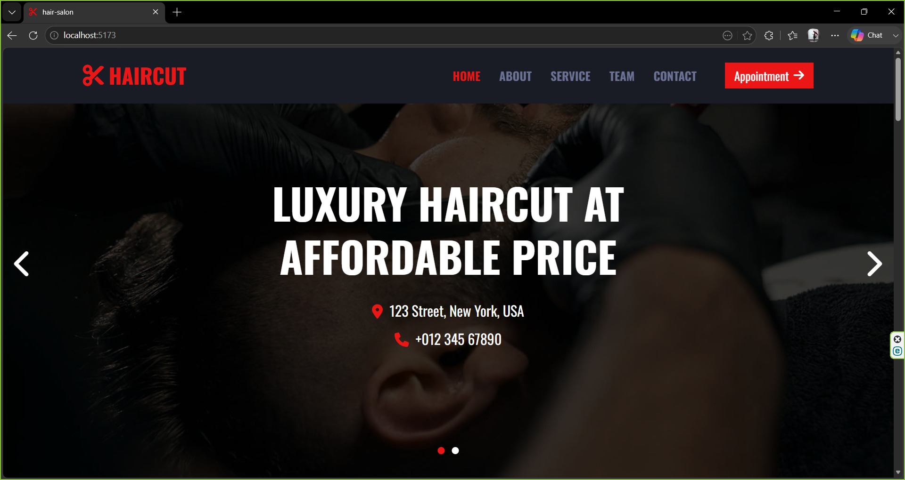

# 💈 Barber Shop Website

## 📝 About the Project

This project is a responsive barber shop website built with **React**, **Vite**, and **Tailwind CSS**.

The user interface and design are based on an existing barber shop website and were recreated for learning and practice purposes. While the visual design is not my original work, I developed the website using React, built reusable components, implemented a responsive layout, and wrote the frontend application code.

## ✨ Features

- 💈 Modern barber shop landing page
- 📱 Fully responsive design
- 🧭 Responsive navigation bar
- 🏠 Hero section with image slider
- 👤 About Us section
- ✂️ Services section
- 💲 Pricing section
- 👨‍🔧 Meet Our Barbers section
- 💬 Customer testimonials
- 📅 Appointment page
- 📞 Contact page
- 🦶 Footer with quick links and social media
- ⚡ Built with reusable React components

## 🛠️ Technologies Used

- React
- Vite
- Tailwind CSS
- JavaScript (ES6+)
- React Router
- Swiper.js
- React Icons
- Google Fonts (Oswald)

## 🚀 Installation

Clone the repository:

```bash
git clone https://github.com/marziehfezydev/barbershop.git
```

Navigate to the project folder:

```bash
cd barbershop
```

Install dependencies:

```bash
npm install
```

Start the development server:

```bash
npm run dev
```

## 🌐 Live Demo

**Live Website:** https://barbershop-jade-chi.vercel.app/

## 📸 Screenshot


